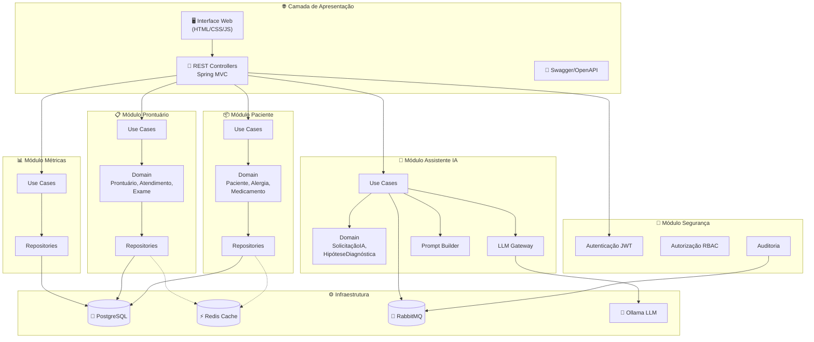
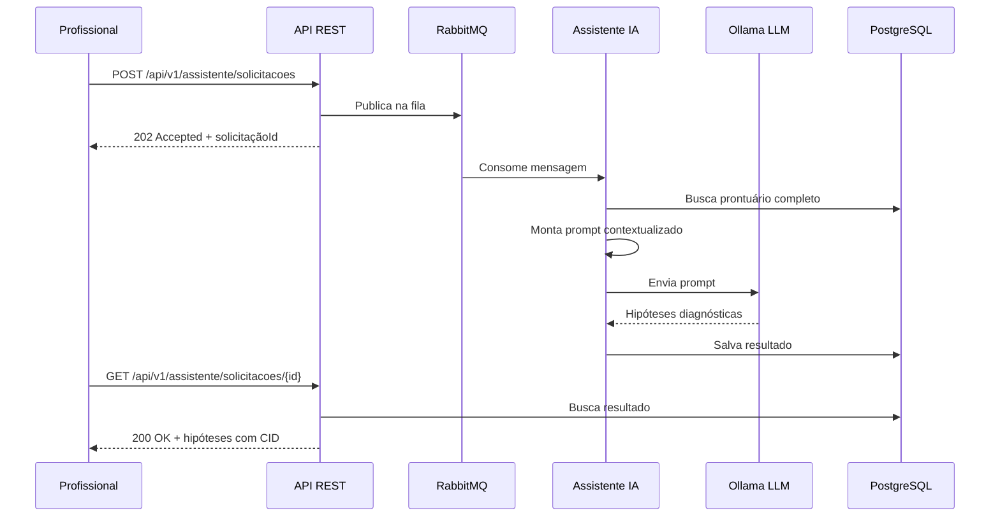

<p align="center">
  
  
  
  
  
  
  
  
</p>

<h1 align="center">🏥 SUS Smart Assistant</h1>

<p align="center">
  <strong>Prontuário Eletrônico Unificado com Assistente Inteligente de IA para o SUS</strong>
</p>

<p align="center">
  <em>Centralizando informações clínicas e acelerando diagnósticos com inteligência artificial local</em>
</p>

---

## 📋 Índice

- [O Problema](#-o-problema)
- [A Solução](#-a-solução)
- [Arquitetura](#-arquitetura)
- [Stack Tecnológica](#-stack-tecnológica)
- [Como Executar](#-como-executar)
- [Credenciais de Demonstração](#-credenciais-de-demonstração)
- [Endpoints da API](#-endpoints-da-api)
- [Interface Web de Demonstração](#-interface-web-de-demonstração)
- [Decisões Arquiteturais (ADRs)](#-decisões-arquiteturais-adrs)
- [Estrutura do Projeto](#-estrutura-do-projeto)
- [Melhorias Futuras](#-melhorias-futuras)

---

## 🔴 O Problema

O Sistema Único de Saúde (SUS) atende mais de **150 milhões de brasileiros**, mas enfrenta desafios críticos na gestão de informações clínicas:

- **📝 Médicos repetem perguntas** — sem acesso ao histórico completo, profissionais precisam refazer anamneses a cada consulta
- **🏥 Prontuários fragmentados** — cada unidade de saúde mantém registros isolados, sem interoperabilidade
- **⏱️ Tempo perdido em documentação** — profissionais gastam até 40% do tempo de consulta preenchendo formulários
- **⚠️ Riscos clínicos** — sem visão unificada de alergias, medicamentos e diagnósticos anteriores, erros médicos são mais prováveis
- **🔒 Dados sensíveis desprotegidos** — muitos sistemas não seguem a LGPD para dados de saúde

---

## ✅ A Solução

O **SUS Smart Assistant** é um backend monolítico modular que resolve esses problemas com duas frentes:

### 1. Prontuário Eletrônico Unificado
Um registro digital centralizado que acompanha o paciente em **qualquer unidade de saúde** — similar ao conceito do gov.br para a Receita Federal. Inclui:
- Dados cadastrais, alergias e medicamentos em uso
- Histórico completo de atendimentos e exames
- Controle de acesso por perfil (médico, paciente, gestor)
- Auditoria de todos os acessos (LGPD)

### 2. Assistente Inteligente com IA Local
Um módulo de inteligência artificial que analisa o prontuário completo do paciente e sugere **hipóteses diagnósticas** ao médico:
- Monta prompt contextualizado com todo o histórico clínico
- Detecta reincidências de diagnósticos anteriores
- Alerta sobre contraindicações baseadas em alergias
- Executa localmente via **Ollama** (sem enviar dados para APIs externas)

---

## 🏗️ Arquitetura

O sistema segue **Clean Architecture** com **Monolito Modular**, organizando o código em 5 módulos independentes com comunicação via interfaces e eventos assíncronos.



### Fluxo do Assistente Inteligente (Assíncrono)



---

## 🛠️ Stack Tecnológica

| Tecnologia | Versão | Justificativa |
|:-----------|:-------|:-------------|
| **Java** | 21 (LTS) | Performance, tipagem forte, ecossistema maduro para sistemas de saúde |
| **Spring Boot** | 3.4.1 | Framework enterprise padrão, suporte a profiles, cache, mensageria e segurança |
| **PostgreSQL** | 16 | Banco robusto com suporte a JSON, amplamente usado no governo brasileiro |
| **H2** | — | Banco em memória para desenvolvimento local sem dependências externas |
| **Redis** | 7 | Cache de alta performance para consultas frequentes de prontuário (TTL configurável) |
| **RabbitMQ** | 3 | Mensageria assíncrona para processamento de IA e auditoria (mais simples que Kafka para MVP) |
| **Ollama** | latest | LLM local — dados sensíveis nunca saem do ambiente, sem custo de API, conformidade LGPD |
| **Docker Compose** | 3.8 | Ambiente reproduzível com um único comando (`docker-compose up`) |
| **Spring Security + JWT** | — | Autenticação stateless com RBAC (Profissional, Paciente, Gestor) |
| **Springdoc OpenAPI** | 2.8.6 | Documentação automática da API com Swagger UI |
| **jqwik** | 1.9.2 | Property-based testing para validação de invariantes de domínio |
| **JaCoCo** | 0.8.12 | Relatório de cobertura de testes (meta: 80% em domínio e use cases) |
| **Testcontainers** | 1.20.4 | Testes de integração com containers reais (PostgreSQL) |

---

## 🚀 Como Executar

### Pré-requisitos

- **Docker** e **Docker Compose** instalados (para Opção 1)
- **Java 21+** e **Gradle** (para Opção 2)

---

### Opção 1: Docker Compose (Stack Completa) 🐳

Sobe todos os serviços com um único comando:

```bash
# 1. Clonar o repositório
git clone <url-do-repositorio>
cd sus-smart-assistant

# 2. Subir todos os serviços
docker-compose up --build -d

# 3. Aguardar os health checks (30-60 segundos)
docker-compose ps

# 4. Baixar o modelo de IA no Ollama
docker exec sus-ollama ollama pull llama3

# 5. Acessar a aplicação
# API:        http://localhost:8080
# Swagger:    http://localhost:8080/swagger-ui.html
# RabbitMQ:   http://localhost:15672 (guest/guest)
```

**Serviços iniciados:**

| Serviço | Porta | Descrição |
|:--------|:------|:----------|
| App (Spring Boot) | `8080` | API REST + Interface Web |
| PostgreSQL | `5432` | Banco de dados principal |
| Redis | `6379` | Cache de consultas |
| RabbitMQ | `5672` / `15672` | Mensageria + Painel de gestão |
| Ollama | `11434` | LLM local para IA |

---

### Opção 2: Desenvolvimento Local 💻

Executa apenas a aplicação Spring Boot com H2 em memória — **sem necessidade de Redis, RabbitMQ ou PostgreSQL**:

```bash
# 1. Clonar o repositório
git clone <url-do-repositorio>
cd sus-smart-assistant

# 2. Executar com profile dev (H2 + dados mockados)
./gradlew bootRun

# 3. Acessar a aplicação
# API:        http://localhost:8080
# Swagger:    http://localhost:8080/swagger-ui.html
# H2 Console: http://localhost:8080/h2-console (JDBC URL: jdbc:h2:mem:sussmartassistant)
```

> **Nota:** No profile `dev`, o cache usa implementação simples em memória e o RabbitMQ é desabilitado. O Assistente IA requer Ollama rodando localmente (`ollama serve` + `ollama pull llama3`).

---

## 🔑 Credenciais de Demonstração

O sistema é inicializado com usuários mockados para teste:

| Usuário | Senha | Perfil | Acesso |
|:--------|:------|:-------|:-------|
| `medico1` | `senha123` | Profissional | Prontuários, atendimentos, assistente IA |
| `paciente1` | `senha123` | Paciente | Visualização do próprio prontuário |
| `gestor1` | `senha123` | Gestor | Métricas e dashboards |

**Como autenticar:**

```bash
# Login (retorna JWT)
curl -X POST http://localhost:8080/api/v1/auth/login \
  -H "Content-Type: application/json" \
  -d '{"username": "medico1", "senha": "senha123"}'

# Usar o token nas requisições seguintes
curl http://localhost:8080/api/v1/pacientes?cpf=12345678901 \
  -H "Authorization: Bearer <seu-token-jwt>"
```

---

## 📡 Endpoints da API

### Autenticação

| Método | Endpoint | Descrição |
|:-------|:---------|:----------|
| `POST` | `/api/v1/auth/login` | Autenticação (retorna JWT) |

### Pacientes

| Método | Endpoint | Descrição |
|:-------|:---------|:----------|
| `POST` | `/api/v1/pacientes` | Cadastrar paciente |
| `GET` | `/api/v1/pacientes?cpf={cpf}` | Buscar paciente por CPF |
| `POST` | `/api/v1/pacientes/{id}/alergias` | Registrar alergia |
| `GET` | `/api/v1/pacientes/{id}/alergias` | Listar alergias (ordenadas por gravidade) |
| `POST` | `/api/v1/pacientes/{id}/medicamentos` | Registrar medicamento |
| `GET` | `/api/v1/pacientes/{id}/medicamentos` | Listar medicamentos ativos |
| `PATCH` | `/api/v1/pacientes/{id}/medicamentos/{medId}/descontinuar` | Descontinuar medicamento |

### Prontuário

| Método | Endpoint | Descrição |
|:-------|:---------|:----------|
| `GET` | `/api/v1/prontuarios/{pacienteId}` | Consultar prontuário completo |
| `POST` | `/api/v1/prontuarios/{pacienteId}/atendimentos` | Registrar atendimento |
| `GET` | `/api/v1/prontuarios/{pacienteId}/atendimentos` | Listar atendimentos (paginado, filtros por período/CID) |
| `POST` | `/api/v1/prontuarios/{pacienteId}/exames` | Registrar exame |
| `GET` | `/api/v1/prontuarios/{pacienteId}/exames` | Listar exames (paginado, filtros por tipo/período) |

### Assistente Inteligente (IA)

| Método | Endpoint | Descrição |
|:-------|:---------|:----------|
| `POST` | `/api/v1/assistente/solicitacoes` | Solicitar hipóteses diagnósticas (retorna 202) |
| `GET` | `/api/v1/assistente/solicitacoes/{id}` | Consultar resultado da solicitação |

### Visualização pelo Paciente

| Método | Endpoint | Descrição |
|:-------|:---------|:----------|
| `GET` | `/api/v1/meu-prontuario` | Paciente visualiza próprio prontuário (somente leitura) |

### Métricas (Gestores)

| Método | Endpoint | Descrição |
|:-------|:---------|:----------|
| `GET` | `/api/v1/metricas/atendimentos` | Total de atendimentos por período/unidade |
| `GET` | `/api/v1/metricas/diagnosticos` | Diagnósticos mais frequentes (CID) |
| `GET` | `/api/v1/metricas/assistente` | Métricas de uso do assistente IA |

### Cadastros Administrativos

| Método | Endpoint | Descrição |
|:-------|:---------|:----------|
| `POST` | `/api/v1/unidades-saude` | Cadastrar unidade de saúde |
| `GET` | `/api/v1/unidades-saude` | Listar unidades de saúde |
| `POST` | `/api/v1/profissionais` | Cadastrar profissional de saúde |

### Observabilidade

| Método | Endpoint | Descrição |
|:-------|:---------|:----------|
| `GET` | `/actuator/health` | Health check do sistema |
| `GET` | `/actuator/metrics` | Métricas operacionais |
| `GET` | `/swagger-ui.html` | Documentação interativa da API |

> 📖 **Documentação completa e interativa disponível no Swagger UI:** `http://localhost:8080/swagger-ui.html`

---

## 🖥️ Interface Web de Demonstração

O sistema inclui uma interface web leve para demonstração visual:

| Página | URL | Descrição |
|:-------|:----|:----------|
| Login | `/index.html` | Autenticação com JWT |
| Dashboard | `/dashboard.html` | Busca por CPF, visualização de prontuário completo |
| Assistente IA | `/assistente.html` | Formulário de sintomas + hipóteses diagnósticas |
| Métricas | `/metricas.html` | Dashboard de métricas para gestores |

---

## 📐 Decisões Arquiteturais (ADRs)

### ADR-1: Clean Architecture — Domínio independente de frameworks

**Contexto:** O sistema precisa ser testável, manutenível e preparado para evolução.

**Decisão:** A camada de domínio (`domain/`) e casos de uso (`application/`) **não possuem dependências de Spring, JPA ou qualquer framework**. Toda comunicação com infraestrutura ocorre via interfaces (ports).

**Consequência:** Use cases podem ser testados unitariamente com mocks simples. Trocar o banco de dados ou framework web não afeta a lógica de negócio.

---

### ADR-2: Monolito Modular — Por que não microserviços

**Contexto:** Para um MVP de hackathon, microserviços adicionam complexidade operacional desnecessária (service discovery, API gateway, tracing distribuído).

**Decisão:** Monolito modular com 5 módulos bem separados por pacotes Java. Cada módulo tem suas próprias camadas `domain/`, `application/` e `infrastructure/`.

**Consequência:** Deploy simples (um único JAR), mas com separação clara que permite migração futura para microserviços extraindo módulos individualmente.

---

### ADR-3: Ollama (LLM Local) — Privacidade e custo zero

**Contexto:** Dados de saúde são extremamente sensíveis (LGPD). APIs pagas (OpenAI, Claude) enviam dados para servidores externos e geram custos recorrentes.

**Decisão:** Usar **Ollama** para executar modelos LLM localmente (Llama 3, Mistral, BioMistral). Dados nunca saem do ambiente.

**Consequência:** Conformidade total com LGPD, sem custo de API, mas requer hardware com capacidade para rodar o modelo (mínimo 8GB RAM para modelos 7B).

---

### ADR-4: RabbitMQ — Simplicidade sobre Kafka

**Contexto:** O sistema precisa de mensageria assíncrona para processamento de IA e auditoria.

**Decisão:** RabbitMQ ao invés de Kafka. Para o escopo do MVP, RabbitMQ oferece filas simples com DLQ, é mais leve e tem menor curva de aprendizado.

**Consequência:** Configuração simples, painel de gestão incluso, suporte a Dead Letter Queues. Para escala massiva futura, migração para Kafka seria considerada.

---

### ADR-5: Redis Cache com Fallback Gracioso

**Contexto:** Consultas de prontuário são frequentes e precisam ser rápidas. Porém, o cache não pode ser ponto único de falha.

**Decisão:** Spring Cache com Redis e TTLs configuráveis por tipo de dado. Quando Redis está indisponível, o sistema bypassa o cache e consulta diretamente o PostgreSQL.

**Consequência:** Performance otimizada no cenário normal, degradação graciosa sem indisponibilidade quando Redis falha.

| Cache | TTL | Invalidação |
|:------|:----|:------------|
| Dados do paciente | 30 min | Ao atualizar cadastro |
| Alergias | 15 min | Ao registrar nova alergia |
| Medicamentos | 15 min | Ao registrar/descontinuar |
| Prontuário | 10 min | Ao registrar atendimento/exame |

---

## 📁 Estrutura do Projeto

```
sus-smart-assistant/
├── 📄 docker-compose.yml          # Orquestração de todos os serviços
├── 📄 Dockerfile                   # Build multi-stage da aplicação
├── 📄 build.gradle                 # Dependências e plugins
├── 📄 postman_collection.json      # Collection para demonstração
│
├── 📂 src/main/java/com/sussmartassistant/
│   ├── 📄 SusSmartAssistantApplication.java
│   │
│   ├── 📂 paciente/                # 👤 Módulo Paciente
│   │   ├── 📂 domain/              #    Entidades: Paciente, Alergia, MedicamentoEmUso
│   │   ├── 📂 application/         #    Use Cases + Ports (interfaces de repositório)
│   │   └── 📂 infrastructure/      #    JPA Entities, Repos, Controllers, DTOs
│   │
│   ├── 📂 prontuario/              # 📋 Módulo Prontuário
│   │   ├── 📂 domain/              #    Entidades: Prontuário, RegistroAtendimento, Exame
│   │   ├── 📂 application/         #    Use Cases + Ports
│   │   └── 📂 infrastructure/      #    JPA, Controllers, paginação
│   │
│   ├── 📂 assistente/              # 🤖 Módulo Assistente Inteligente
│   │   ├── 📂 domain/              #    Entidades: SolicitacaoIA, HipoteseDiagnostica
│   │   ├── 📂 application/         #    Use Cases, LlmGateway, PromptBuilder
│   │   └── 📂 infrastructure/      #    Ollama client, RabbitMQ producer/consumer, MockLlmGateway
│   │
│   ├── 📂 seguranca/               # 🔐 Módulo Segurança/Auditoria
│   │   ├── 📂 domain/              #    Entidades: Usuario, EventoAuditoria
│   │   ├── 📂 application/         #    Use Cases de autenticação + AuditoriaEventPublisher
│   │   └── 📂 infrastructure/      #    JWT filter, Spring Security config, RabbitMQ auditoria
│   │
│   ├── 📂 metricas/                # 📊 Módulo Métricas
│   │   ├── 📂 domain/              #    Entidades: MetricasAssistente, DiagnosticoFrequente
│   │   ├── 📂 application/         #    Use Cases de consulta
│   │   └── 📂 infrastructure/      #    JPA queries de agregação, Controllers
│   │
│   └── 📂 shared/                  # 🔧 Módulo Compartilhado
│       ├── 📂 domain/              #    Value Objects: CPF, CNS, CID, PageResult, Enums
│       ├── 📂 application/         #    Unidades de Saúde, Profissionais
│       └── 📂 infrastructure/      #    Exception Handler, DataLoader, SecurityConfig, CacheConfig
│
├── 📂 src/main/resources/
│   ├── 📄 application.yml          # Configuração base
│   ├── 📄 application-dev.yml      # Profile dev (H2, Swagger, dados mockados)
│   ├── 📄 application-test.yml     # Profile test (Testcontainers)
│   ├── 📄 application-prod.yml     # Profile prod (PostgreSQL, segurança)
│   ├── 📄 logback-spring.xml       # Logging estruturado JSON
│   └── 📂 static/                  # Interface web de demonstração
│       ├── 📄 index.html           # Página de login
│       ├── 📄 dashboard.html       # Busca e visualização de prontuário
│       ├── 📄 assistente.html      # Assistente IA
│       ├── 📄 metricas.html        # Dashboard de métricas
│       ├── 📂 css/style.css
│       └── 📂 js/app.js
│
└── 📂 src/test/java/               # Testes unitários + property-based tests
    └── 📂 com/sussmartassistant/
        ├── 📂 paciente/application/     # CadastrarPacienteUseCaseTest, AlergiaUseCasesTest, MedicamentoUseCasesTest
        ├── 📂 prontuario/application/   # ProntuarioUseCasesTest
        ├── 📂 assistente/application/   # AssistenteUseCasesTest
        ├── 📂 metricas/application/     # MetricasUseCasesTest
        ├── 📂 shared/domain/            # CPFTest, CNSTest, CIDTest (property-based com jqwik)
        └── 📂 shared/infrastructure/    # CorrelationIdFilterTest, GlobalExceptionHandlerTest
```

---

## 🔮 Melhorias Futuras

| Área | Melhoria | Descrição |
|:-----|:---------|:----------|
| 🏥 Integração | Sistemas reais do SUS | Conectar com CNES, DATASUS, e-SUS e SISREG via ports de integração |
| 🧠 IA | Modelos especializados | Treinar/fine-tunar modelos biomédicos (BioMistral, Med-PaLM) para maior precisão |
| 🌎 Escala | Multi-região | Migrar para microserviços com Kubernetes para atender múltiplas regiões |
| 📱 Frontend | App mobile | Aplicativo para pacientes visualizarem prontuário e receberem notificações |
| 📊 Analytics | ML preditivo | Modelos de machine learning para predição de surtos e demanda por unidade |
| 🔐 Segurança | Certificado digital | Integração com ICP-Brasil para assinatura digital de prontuários |
| 🗣️ Acessibilidade | Interface por voz | Assistente por voz para profissionais durante atendimento |
| 📋 Interoperabilidade | HL7 FHIR | Adotar padrão internacional de interoperabilidade em saúde |

---

<p align="center">
  Desenvolvido com ❤️ para o <strong>SUS</strong> — porque saúde pública de qualidade é um direito de todos
</p>

<p align="center">
  
  
</p>
